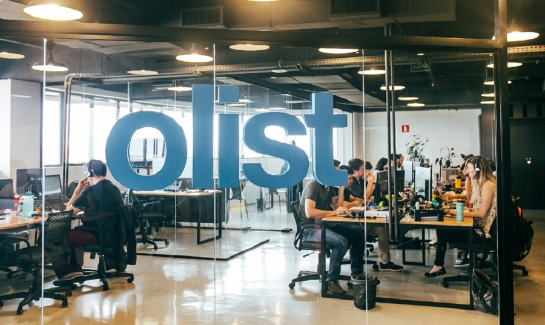

# 0. Overview

## Rio de Janeiro

**This is a data analysis project.**

But first, let's take a trip to Brazil:

<iframe
  width="100%"
  height="415"
  src="https://www.youtube.com/embed/iNfEAJVVY10"
  frameborder="0"
  allow="accelerometer; autoplay; clipboard-write; encrypted-media; gyroscope; picture-in-picture"
  allowfullscreen
></iframe>

A country known for its vibrant culture, diverse landscapes, and bustling cities. Brazil is the largest country in South America and the fifth largest in the world, with a population of over 210 million people. It boasts a rich history, from its indigenous roots to Portuguese colonization, and is famous for its festivals like Carnival, its love for football (soccer), and its iconic landmarks such as Christ the Redeemer in Rio de Janeiro.

:::tip
Your head pops a question:

> How would a day in the life of a data analyst at Olist look like?

Let's look it up: https://www.youtube.com/results?search_query=a+day+in+life+of+software+engineer+in+rio+de+janeiro+

:::

Watch: A Day in the Life of a SWE in Rio de Janeiro (Work from Home)

<iframe width="100%" height="500" src="https://www.youtube.com/embed/Y29cre1rl6o" frameborder="0" allow="accelerometer; autoplay; clipboard-write; encrypted-media; gyroscope; picture-in-picture" allowfullscreen></iframe>

<iframe width="100%" height="500" src="https://www.youtube.com/embed/_ALWnUOKOEA" frameborder="0" allow="accelerometer; autoplay; clipboard-write; encrypted-media; gyroscope; picture-in-picture" allowfullscreen></iframe>

  

    Watch: A Day in the Life of a SWE in Rio de Janeiro (Work from Office)
  

  <iframe
    width="100%"
    height="500"
    src="https://www.youtube.com/embed/6pdNrPBUwwI"
    frameborder="0"
    allow="accelerometer; autoplay; clipboard-write; encrypted-media; gyroscope; picture-in-picture"
    allowfullscreen
  ></iframe>

---

## Olist

**You are hired by Olist.**

Congratulations! Let's learn more about the company.

1. Go to Goggle and search for "Olist headquarters".
2. Find the location and go to [Street View](https://www.google.com/maps/place/Av.+C%C3%A2ndido+Hartmann,+590+-+Merc%C3%AAs,+Curitiba+-+PR,+80710-570,+Brazil/@-25.4306315,-49.2945354,17z/data=!3m1!4b1!4m6!3m5!1s0x94dce3f1a957b2b9:0x9779f226a731d7bd!8m2!3d-25.4306364!4d-49.2919551!16s%2Fg%2F11c5c8p_2_?entry=ttu&g_ep=EgoyMDI1MTEyMy4xIKXMDSoASAFQAw%3D%3D).
3. A quick look at Olist's Office:

<iframe
  width="100%"
  height="500"
  src="https://www.youtube.com/embed/iy5gJye8N-A"
  frameborder="0"
  allow="accelerometer; autoplay; clipboard-write; encrypted-media; gyroscope; picture-in-picture"
  allowfullscreen
></iframe>

---

## You are

A newly hired data analyst at Olist, a Brazilian e-commerce platform that helps small and medium businesses sell online by connecting them to major marketplaces and logistics partners.

- **Role**: Junior Data
- **Guild**: Business Intelligence Team
- **Setting**: Olist (Brazilian E-Commerce Giant)

Here is your manager:

