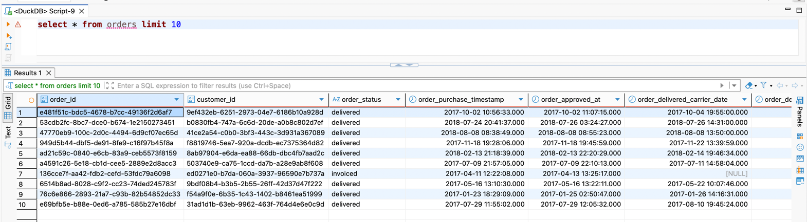

# Level 0: Prepare Environment

:::note Question

Before diving into the missions, ensure you have access to the Olist database. Set up your SQL environment and familiarize yourself with the following datasets.

Choose either:

- [RunSQL](https://runsql.com/r)
- [Dbeaver](https://dbeaver.io/download/)

The data is available at: https://public.lelouvincx.com/brazilian_ecommerce.duckdb

**Goal**: Ready your SQL environment by querying `SELECT * FROM olist_orders_dataset` to confirm access.

**Example Result:**

:::
