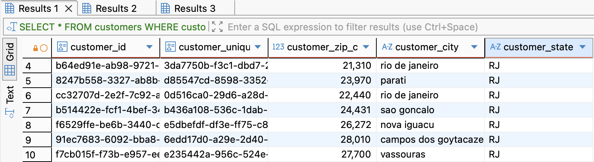
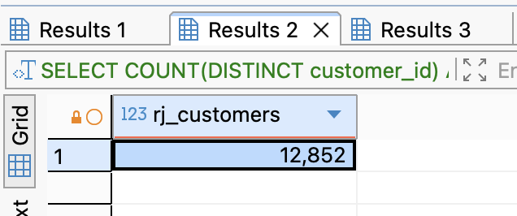
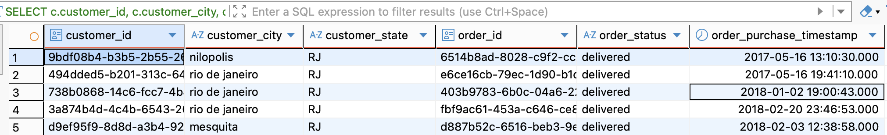

# Level 1: SQL Exploration

_Objective: Find and understand your dataset._

**Story beat**
Before you analyze anything, you must locate **who** in the dataset lives in RJ and **what orders** belong to them. You’re drawing a map of the crisis zone.

---

## Task 1.1: Know Your Audience (Simple Filtering)

:::note Question
**Business Value:** Before we analyze behavior, we need to know the size of our cohort in Rio de Janeiro.

- **Goal:** List all customer profiles located in the state of Rio de Janeiro ('RJ').

- **Success Criteria:**
  - "How many unique customers do we have in Rio de Janeiro?" _(Hint: It should be around 12,000+ rows)_.
  - "Besides the city 'rio de janeiro', what other cities appear in this list?"

<details>
<summary>💡 Hint</summary>

- Which table contains customer location information?
- What column would tell you the state where a customer lives?

</details>
:::

- **Question 1: List all customer profiles located in the state of Rio de Janeiro ('RJ')**

```sql 
SELECT *
FROM customers
WHERE customer_state = 'RJ';
```



- **Question 2: How many unique customers do we have in Rio de Janeiro?**

```sql
SELECT COUNT(DISTINCT customer_id) AS rj_customers
FROM customers
WHERE customer_state = 'RJ';
```



- **Question 3: Besides the city 'rio de janeiro', what other cities appear in this list?**
```sql
SELECT
  customer_city,
  COUNT(DISTINCT customer_id) AS n_customers
FROM customers
WHERE customer_state = 'RJ'
GROUP BY customer_city
ORDER BY n_customers DESC, customer_city;
```


---

## Task 1.2: The Transaction History (Basic Join)

:::note Question
**Business Value:** A customer profile is useless without their purchase history. We need to attach orders to these people.

- **Goal:** Join the Orders table to the Customers table to find every order placed by an RJ customer.

- **Success Criteria:**
  - "Does the row count match your previous query, or is it different? Why?"
  - "Can you see the `order_status` column in the results?"

<details>
<summary>💡 Hint</summary>

- You need to combine customer and order information
- What field connects customers to their orders?
- Build upon your previous query from Task 1

</details>
:::

-**Question 1: Join the Orders table to the Customers table to find every order placed by an RJ customer:**
```sql
SELECT
  c.customer_id,
  c.customer_city,
  c.customer_state,
  o.order_id,
  o.order_status,
  o.order_purchase_timestamp
FROM customers c
JOIN orders o
  ON c.customer_id = o.customer_id
WHERE c.customer_state = 'RJ';
```


- **Question 2:Does the row count match your previous query, or is it different? Why?**
> Số lượng row khác nhau giữa task 1.2 và task 1.1( ở 1.2 lớn hơn) do ở 1.1 lấy kết quả theo unique customers, tức mỗi hàng tương ứng với 1 KH; còn task 1.2 lấy tất cả các đơn hàng của KH sống ở bang RJ, 1 dòng tương ứng với 1 đơn hàng do đó 1 KH có thể có nhiều đơn hàng => số rows nhiều hơn task 1.1

- **Question 3:"Can you see the order_status column in the results?"**
> Cột order_status xuất hiện vì sau khi join bảng Orders với bảng Customers, tất cả thông tin đơn hàng liên quan đến mỗi khách hàng ở RJ đều được đưa vào kết quả.
---

## Task 1.3: The Timeline (Date Handling)

:::note Question
**Business Value:** The VP needs to know if this is a recent problem or a historical one. We need to establish the date range of our data.

- **Goal:** Find the date range of all orders placed in RJ.

- **Success Criteria:**
  - "What is the date of the very first order in RJ?"
  - "When was the last order placed?"
  - "Does this cover the Black Friday period?"

<details>
<summary>💡 Hint</summary>

- Think about aggregate functions for finding earliest and latest values
- Which column contains the purchase date/time?
- Consider formatting the output for better readability

</details>
:::

- **Question 1: Find the date range of all orders placed in RJ**

---

## Task 1.4: The Funnel Audit (Aggregation & Nulls)

:::note Question
**Business Value:** Not all orders make it to the customer. We need to see how many orders were actually delivered vs. cancelled or unavailable.

- **Goal:** Count the number of orders per `order_status` for RJ customers.

- **Success Criteria:**
  - "How many orders in RJ were 'canceled'?"
  - "How many were 'delivered'?"
  - _Critical Check:_ "Are there any statuses where the count is surprisingly high?"

<details>
<summary>💡 Hint</summary>

- You need to count orders grouped by their status
- What SQL clause helps you organize data into categories?
- How can you sort the results to see the most common statuses first?

</details>
:::

---

## Task 1.5: The "Pulse Check" (3-Table Join)

:::note Question
**Business Value:** Now we need the "Voice of the Customer." We need to see the average star rating for these specific orders.

- **Goal:** Calculate the average review score for all **delivered** orders in RJ.

- **Success Criteria:**
  - "What is the average score for RJ? (Is it below 4.0?)"
  - "How does this compare if you remove the 'RJ' filter and look at the whole country?"

<details>
<summary>💡 Hint</summary>

- You need to bring in review data from another table
- What aggregate function calculates averages?
- Remember to filter for both RJ customers and delivered orders only

</details>
:::

---
