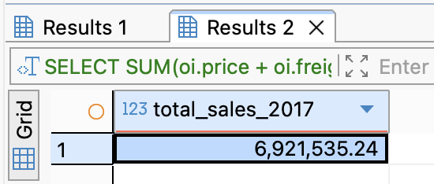
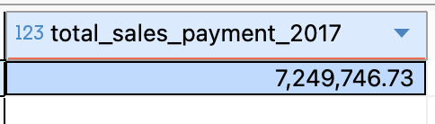
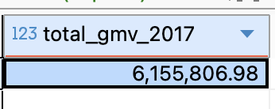
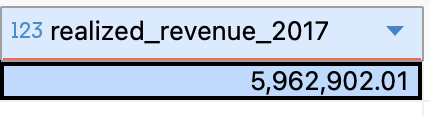

# Level 2: Simple Question

---

## Problem 2.1: Data request from Sales

You receive the following email from Sofia, the Regional Sales Manager.

:::info Email
**From**: Sofia (Regional Sales Manager)

**To**: Data Team

**Subject**: URGENT: 2017 Numbers

> "Hey team! 👋
> I'm preparing my slide deck for the board meeting tomorrow. I need to know our Total Sales for 2017.
> Just get me the single number. Thanks!"

:::

**Logic / Approach:**

1.Identify the table that contains sales value:

- Sales value is stored in the order_items table
- Relevant columns: price (item price), freight_value (shipping cost)

2. Filter by time period and valid orders:

- The order date and order status are stored in the orders table -> JOIN orders with order_items using order_id
- Filter orders placed in 2017 using order_purchase_timestamp
- Only include orders with order_status = 'delivered'

3. Calculate Total Sales:

- Total Sales = SUM(price + freight_value) for delivered orders in 2017

```sql
SELECT
  SUM(oi.price + oi.freight_value) AS total_sales_2017
FROM orders o
JOIN order_items oi
  ON o.order_id = oi.order_id
WHERE o.order_status = 'delivered'
  AND o.order_purchase_timestamp >= '2017-01-01'
  AND o.order_purchase_timestamp < '2018-01-01';
```



**Total Sales for 2017 is: 6,921,535.24**

## Problem 2.2 What really is Total Sales?

:::info Question
Is it easy? Do you think: "Too easy hahaha. I'll just sum up the price and the shipping cost."?

The total sales for 2017 is: **6,921,535.24 BRL.** Then you email Sofia back with the number.

**Pause.**

Sofia replies:

> "Thanks for the quick response! Just to be sure, why does that number sum up the shipping cost?"

**If you are the boss of Shopee, do you really want to include shipping cost in Total Sales?**

In the world of data, "Sales" is not a column name. It is a Business Term, and Business Terms are dangerous because they are ambiguous.

If you rush to answer Sofia, you will likely fall into the Definition Gap.

Let's look at the database. You have three possible ways to calculate "Total Sales". Can you write the SQL for each of them?
:::

:::tip Option 1
Calculate Total Sales as the sum of the `payment_value` from the `payments` table **for all orders made in 2017**.
:::

Answer 1: **Total Sales for 2017 is: 7,249,746.73**

**Logic / Approach:**

- Payment amounts are stored in the _order_payments_ table (payment_value)

- An order can have multiple payment records, so all payment values must be summed.

- JOIN _orders_ table to _order_payments_ table using _order_id_ to filter by time

- Filter orders placed in 2017 using _orders.order_purchase_timestamp_

```sql
SELECT
  SUM(op.payment_value) AS total_sales_payment_2017
FROM orders o
JOIN order_payments op
  ON o.order_id = op.order_id
WHERE o.order_purchase_timestamp >= '2017-01-01'
  AND o.order_purchase_timestamp <  '2018-01-01';
```



:::tip Option 2
Calculate Total Sales as the Gross Merchandise Value (GMV).

GMV = sum of `price` in the `order_items` table **for all orders made in 2017**.
:::

Answer 2: **Total Sales for 2017 is: 6,155,806.98**

\***\*Logic / Approach:**

- GMV represents the total value of goods ordered, regardless of delivery outcome

- Item prices are stored in the _order_items_ table (price)

- JOIN _orders_ table with _order_items_ table using _order_id_ to filter by time

- Filter orders placed in 2017 using _order.order_purchase_timestamp_

- Sum the price of all items without filtering by order status

```sql
SELECT
  SUM(oi.price) AS total_gmv_2017
FROM orders o
JOIN order_items oi
  ON o.order_id = oi.order_id
WHERE o.order_purchase_timestamp >= '2017-01-01'
  AND o.order_purchase_timestamp <  '2018-01-01';
```



:::tip Option 3
Calculate Total Sales as the Realized Revenue.

Realized Revenue = sum of `price` in the `order_items` table, but **filter out** orders that were not delivered, **for all orders made in 2017**.
:::

Answer 3: **Total Sales for 2017 is: 5,962,902.01**

\***\*Logic / Approach:**

- Realized Revenue includes only sales from orders that were successfully delivered

- Item prices are taken from the _order_items_ table (price)

- JOIN _orders_ table with _order_items_ table using _order_id_

- Filter orders placed in 2017 using _order.order_purchase_timestamp_

- Include only delivered orders by filtering _order_status_ = 'delivered'

```sql
SELECT
  SUM(oi.price) AS realized_revenue_2017
FROM orders o
JOIN order_items oi
  ON o.order_id = oi.order_id
WHERE o.order_status = 'delivered'
  AND o.order_purchase_timestamp >= '2017-01-01'
  AND o.order_purchase_timestamp <  '2018-01-01';
```



## Problem 2.3: Why are they different?

:::info Question
The numbers are different. Why?
:::

**Answer:**

| Option   | Calculation          | Filter                                           |
| -------- | -------------------- | ------------------------------------------------ |
| Option 1 | `sum(payment_value)` | Order date = 2017                                |
| Option 2 | GMV by `sum(price)`  | Order date = 2017                                |
| Option 3 | `sum(price)`         | Order date = 2017 AND order status = "delivered" |

Note:

- Payments may include fees or installment interest
- GMV/Revenue include only item prices

## Problem 2.4: Communicating with Sofia

:::info Question
Write a short email to Sofia, ask for clarification.
:::

> Hi Sofia,
>
> I have a quick question regarding how we should define Total Sales, and would appreciate your clarification on the following points:
>
> 1. What: Should Total Sales represent the total order value or the actual amount paid by customers?
> 2. How: Should Total Sales be calculated across all order statuses, or only specific statuses (e.g. delivered orders only)?
>
> For confirmation, below are the order statuses we currently have. Could you please advise which ones should be included in Total Sales?
>
> - created
> - processing
> - invoiced
> - shipped
> - delivered
> - canceled
> - unavailable
>
> Thanks a lot for your guidance.
>
> Best regards,
