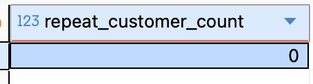

# Level 3: Loyalty Illusion

---

## Problem 3.1: The VIP Program Request

Ting ting! Not the monthly paycheck notification :(, but an email from Kelly, the Marketing Director.

:::info Email
**From**: Kelly (Marketing Director)

**To**: Data Team

**Subject**: VIP List for Coupon Campaign

"Hi Team! 🚀

> We want to launch a 'VIP Loyalty Program' to reward our best users.
>
> I need a list of all Repeat Customers (anyone who has placed more than 1 order with us).
>
> Please give me the count of how many customers qualify. Thanks!

:::

:::tip
This time, use updated duckdb file: **https://public.lelouvincx.com/brazilian_ecommerce.duckdb**
:::

**Total Repeat Customers is: 0**

**Logic / Approach:**

- A “repeat customer” means a customer who comes back and places more than one order

- In the dataset, each row in orders represents one order, and customers are identified by _customer_id_

- Therefore: repeat customer -- number of orders per customer > 1.

- To solve this, we:

> 1. Group by _customer_id_

> 2. Count orders for each customer: _COUNT(order_id)_

> 3. Keep customers with _COUNT(order_id)_ > 1

```sql
WITH repeat_customers AS (
  SELECT
    customer_id
  FROM orders
  GROUP BY customer_id
  HAVING COUNT(order_id) > 1 )
SELECT
  COUNT(*) AS repeat_customer_count
FROM repeat_customers;
```


