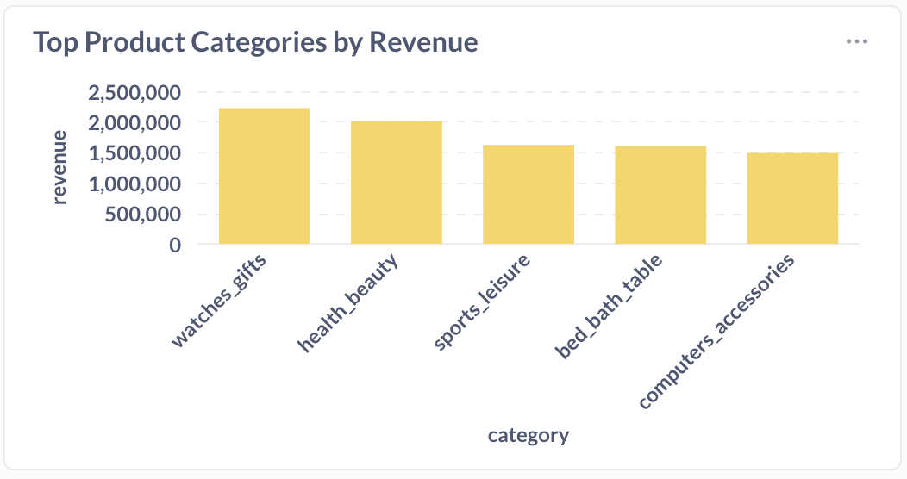

# 3. Top Categories

## Problem

:::info Question
Sofia is impressed by trend chart.

She points to Q1 2017: "Incredible. But what were they buying? Was it electronics? Furniture? I need to know our top drivers so we can stock up for next year."

Deliverable:

- A Metabase question that shows the top product categories by revenue.

:::

**Logic / Approach:**

- Revenue here is Gross Merchandise Value (GMV)

- We need to get the top products that generated the most revenue in Q1/2017, so we need a time reference → use the *order_purchase_timestamp* column as the benchmark

- Order information and order time are in the *orders* table, product prices are in the *order_items* table, while product categories are in the *products* table → INNER JOIN these three tables

- Get the English product category names from the *product_category_translation* table → LEFT JOIN this table with the *products* table

```sql
SELECT
  pct.product_category_name_english AS category,
  SUM(oi.price) AS revenue
FROM order_items oi
JOIN orders o
  ON oi.order_id = o.order_id
JOIN products p
  ON oi.product_id = p.product_id
LEFT JOIN product_category_translation pct
  ON p.product_category_name = pct.product_category_name
WHERE o.order_status = 'delivered'
GROUP BY pct.product_category_name_english
ORDER BY revenue DESC
LIMIT 5;
```

